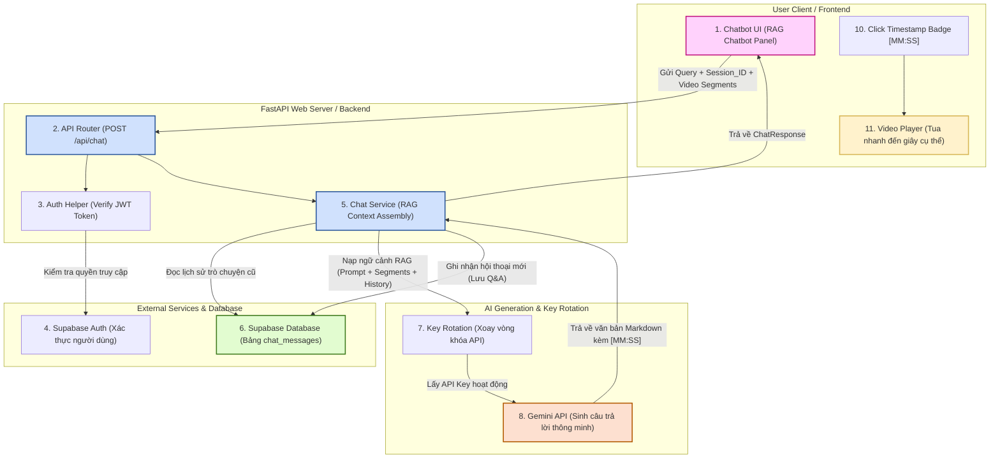

# 🧩 Sơ đồ kiến trúc Chatbot AI Tutor (RAG Pipeline) - StudyMind

Tài liệu này mô tả sơ đồ kiến trúc luồng dữ liệu chi tiết của tính năng Chatbot AI Tutor (Gia sư học tập AI) trong dự án StudyMind. Sơ đồ mô tả luồng đi từ Frontend, Backend, Supabase Auth/DB đến Gemini API Key Rotation.

---

## 📊 Sơ đồ Mermaid:

---

## 📝 Giải thích luồng dữ liệu (11 Bước):

1.  **Gửi yêu cầu từ Client (Frontend):** Người dùng gõ câu hỏi vào chatbot. Hệ thống đóng gói câu hỏi (`query`), mã phòng chat (`session_id`) và phụ đề bài giảng (`segments`) gửi lên Backend.
2.  **Định tuyến API (Backend):** Endpoint `POST /api/chat` tiếp nhận yêu cầu.
3.  **Xác thực người dùng (Auth):** Bộ phận Auth Helper trích xuất mã token JWT của người dùng từ HTTP Headers.
4.  **Supabase Auth đối chiếu:** Liên lạc với Supabase Auth để đảm bảo người dùng đã đăng nhập hợp lệ.
5.  **Dịch vụ Chatbot (Chat Service):** File `app/services/chat.py` tiếp quản luồng xử lý.
6.  **Truy xuất lịch sử (RAG Database Query):** Đọc các tin nhắn hỏi đáp trước đó từ bảng `chat_messages` trên Supabase Database để AI có "trí nhớ ngắn hạn" về cuộc trò chuyện.
7.  **Lắp ghép Prompt & Xoay vòng Key:** Lắp ghép lịch sử chat + câu hỏi mới + phụ đề video thành 1 Prompt hoàn chỉnh. Gọi module `key_rotation.py` để lấy một API Key Gemini còn hạn ngạch sử dụng.
8.  **Gọi mô hình AI (Gemini Flash/Pro):** Gemini tiếp nhận prompt RAG và sinh câu trả lời tiếng Việt, tự động đính kèm các mốc thời gian dạng `[MM:SS]` dựa theo phụ đề.
9.  **Lưu trữ dữ liệu học tập:** Sau khi nhận phản hồi từ AI, Chat Service lập tức lưu cặp câu hỏi-trả lời mới vào bảng `chat_messages` trên database để phục vụ cho các lần hỏi sau.
10. **Hiển thị & Tương tác (Frontend):** Trình duyệt nhận phản hồi, hiển thị câu trả lời dạng Markdown. Các thẻ `[MM:SS]` được tô xanh nổi bật và biến thành nút bấm.
11. **Tua Video:** Khi người học click vào nút timestamp, hệ thống phát tín hiệu tua trực tiếp video YouTube đến đúng phân cảnh đó để người học xem lại giảng viên nói gì.
