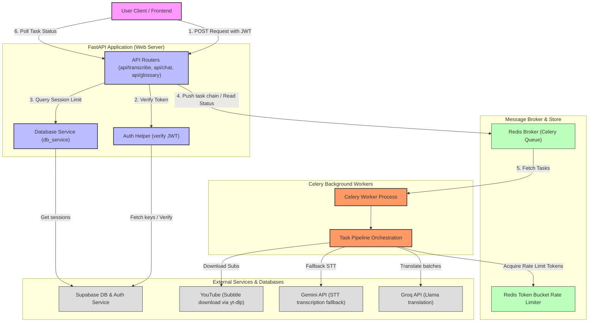
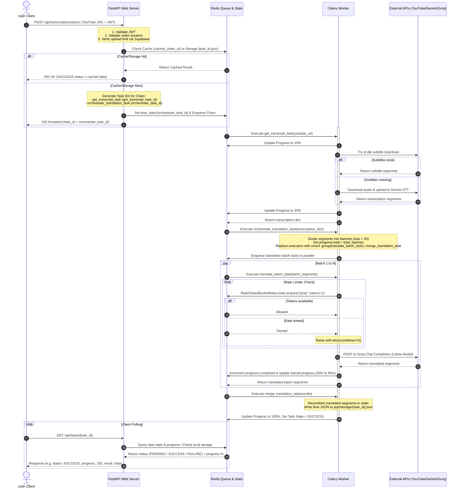

# Backend Architecture: YouTube Transcription & Translation Pipeline

This document describes the backend architecture of the **Smart AI Study Companion**, which is built on FastAPI, Celery, Redis, and Supabase.

---

## 1. High-Level Component Diagram

This diagram shows the main components of the backend system, their communication pathways, and interactions with external APIs.



---

## 2. Asynchronous Task Execution Pipeline (Celery Chord)

When a user submits a YouTube URL via `POST /api/transcriptions/async`, the backend handles the job asynchronously to prevent request timeouts and support concurrent requests. The task is broken down into parallelized sub-tasks using a Celery chain and chord workflow.



---

## 3. Distributed Rate Limiting (Redis Token Bucket)

To prevent hitting the Rate Limits of translation services (e.g., Groq's RPM/TPM), the system coordinates requests via a globally shared token bucket algorithm implemented in Redis.

```mermaid
graph TD
    %% Styling
    classDef worker fill:#f96,stroke:#333,stroke-width:2px;
    classDef redis fill:#bfb,stroke:#333,stroke-width:1px;
    classDef groq fill:#ddd,stroke:#333,stroke-width:1px;

    %% Nodes
    W1["Celery Worker - Process A"]:::worker
    W2["Celery Worker - Process B"]:::worker
    
    subgraph Redis_Limiter ["Redis Distributed Limiter"]
        Lua["Lua script (Atomic operation)"]:::redis
        BucketKey["rate_limit:groq (Hash) <br/>last_updated: timestamp<br/>tokens: current count"]:::redis
    end
    
    GroqAPI["Groq translation API"]:::groq

    %% Flows
    W1 -->|1. acquire('groq', requested=1)| Lua
    W2 -->|1. acquire('groq', requested=1)| Lua
    Lua -->|2. Check capacity & fill tokens| BucketKey
    BucketKey -->|3. Return updated tokens| Lua
    
    Lua -->|4a. Allowed (Tokens >= 1)| W1
    Lua -->|4b. Denied (Tokens < 1)| W2
    
    W1 -->|5. Make API Request| GroqAPI
    Note over W2: Retry task in 5s (countdown=5)<br/>Re-enters Celery queue
```

---

## 4. Key Architectural Tradeoffs & Decisions

### 4.1. Asynchronous Tasks vs. Synchronous Endpoints
* **Tradeoff**: Running heavy downloads, STT fallback, and batch translation synchronously in FastAPI workers would block execution, leading to client timeouts and a low limit on concurrent active users.
* **Decision**: Decompose the operation into a Celery background chain. FastAPI responds immediately with `202 Accepted` and a `task_id`, and the client polls the status. This enables scaling to multiple concurrent requests without thread starvation.

### 4.2. Celery Canvas Chord vs. Single Large Task
* **Tradeoff**: Running all translations in a single loop inside one worker is simple but slow. It doesn't scale to long videos and fails to utilize concurrency.
* **Decision**: Use a Celery `chord` dynamically spawned in `orchestrate_translation_task`. This processes chunks of 20 segments in parallel across multiple worker processes, utilizing multiple Groq connections concurrently while checking the central rate limiter.

### 4.3. Redis Rate Limiter via Lua Script vs. Python Checks
* **Tradeoff**: Standard Python rate-limiting checks are susceptible to race conditions when multiple workers run in parallel.
* **Decision**: Use a Lua script executed atomically inside Redis. This ensures thread-safe check-and-set operations on the rate-limit token bucket across all distributed Celery worker processes.
