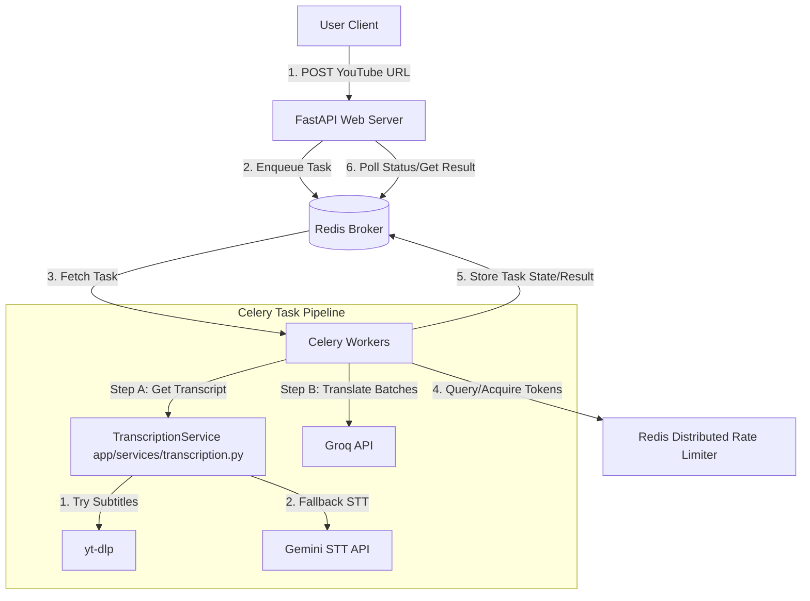

# System Update Plan: Scaling to Multiple Users with Celery, Redis, and Distributed Rate Limiting

## 1. Executive Summary
The current system executes YouTube audio downloading, Gemini transcription, and Groq translation synchronously within FastAPI request threads. This design does not scale:
- Blocking execution prevents serving multiple users concurrently (up to the target of 10 concurrent users).
- Fast concurrent requests trigger Groq API rate limits (RPM/TPM).

To support concurrent users, we will introduce:
1. **FastAPI + Celery + Redis**: Transition heavy tasks (download, transcription, translation) to asynchronous background workers.
2. **Distributed Rate Limiting**: Implement a strict token bucket or sliding window rate limiter in Redis to coordinate LLM API calls across all Celery workers.

---

## 2. Architecture Overview

Below is the proposed task execution workflow:



---

## 3. Celery & Redis Task Design

Instead of executing everything in a single HTTP request, we will decompose the process into discrete, trackable tasks:

### 3.1. Workflow Choreography
We will use Celery's canvas system (`chain` and `group`) to run tasks:

1. **`get_transcript_task(youtube_url: str) -> dict`**:
   - Calls the `TranscriptionService.get_youtube_transcript` which tries to download existing YouTube subtitles (via `yt-dlp`) first, and falls back to Gemini STT only if they are unavailable.
   - Outputs a list of segments and the detected language.
2. **`translate_batch_task(batch_segments: list, lang: str) -> list`**:
   - Translates a batch of up to 20 segments.
   - Queries the Redis Rate Limiter before calling the Groq API.
3. **`merge_translation_task(results: list) -> dict`**:
   - Callback task that merges the translated batches and stores the final result.

---

## 4. Strict Rate Limiter Contract

Since Celery workers run concurrently across multiple threads or processes, they must coordinate to avoid exceeding Groq's rate limits. We will implement a **Distributed Token Bucket Rate Limiter** using Redis.

### 4.1. The Rate Limiter Contract
Every task that interacts with a rate-limited external service (e.g., Groq) must adhere to the following contract:

```python
class RateLimiterContract:
    async def acquire(self, service_name: str, tokens_requested: int) -> bool:
        """
        Attempts to acquire the requested number of tokens for the given service.
        Returns True if tokens were acquired, False if the request is rate-limited.
        """
        pass

    async def get_wait_time(self, service_name: str, tokens_requested: int) -> float:
        """
        Calculates the time (in seconds) the caller must wait before 
        the requested tokens will become available.
        """
        pass
```

### 4.2. Redis Token Bucket Implementation Strategy
We will use a Redis hash to track the state of each rate limit key (e.g., `rate_limit:groq`).

- **Redis Key**: `rate_limit:<service_name>`
- **Hash Fields**:
  - `last_updated`: Timestamp of the last token deduction.
  - `tokens`: Current token balance.
- **Algorithm (Atomic via Lua Script)**:
  1. Retrieve `last_updated` and `tokens`.
  2. Calculate newly generated tokens: `new_tokens = (current_time - last_updated) * fill_rate`.
  3. Update `tokens = min(max_capacity, tokens + new_tokens)`.
  4. If `tokens >= tokens_requested`:
     - Deduct `tokens_requested`.
     - Update `last_updated = current_time`.
     - Return `True`.
  5. Else, return `False` (or calculate and return wait time).

### 4.3. Lua Script for Redis Rate Limiter
```lua
local key = KEYS[1]
local requested = tonumber(ARGV[1])
local capacity = tonumber(ARGV[2])
local fill_rate = tonumber(ARGV[3]) -- tokens per second
local now = tonumber(ARGV[4])

local state = redis.call('HMGET', key, 'last_updated', 'tokens')
local last_updated = tonumber(state[1]) or now
local tokens = tonumber(state[2]) or capacity

-- Replenish tokens based on elapsed time
local elapsed = math.max(0, now - last_updated)
tokens = math.min(capacity, tokens + (elapsed * fill_rate))

if tokens >= requested then
    tokens = tokens - requested
    redis.call('HMSET', key, 'last_updated', now, 'tokens', tokens)
    return 1 -- Allowed
else
    return 0 -- Rate limited
end
```

### 4.4. Celery Worker Integration & Task Retry
When a `translate_batch_task` executes:
1. Estimate the token count of the payload (number of input characters/words).
2. Attempt to `acquire` tokens from Redis.
3. **If successful**: Proceed to call Groq.
4. **If rate-limited**: Calculate retry delay and raise a Celery retry:
   ```python
   # Retry after 5 seconds if rate limited
   raise self.retry(exc=RateLimitExceededException(), countdown=5)
   ```

---

## 5. FastAPI Integration & User Flow

1. **Submission Endpoint**:
   - `POST /api/transcriptions/async`
   - Receives YouTube URL, initiates the Celery chain, and returns a `task_id` with `202 Accepted` status.
2. **Status Polling Endpoint**:
   - `GET /api/tasks/{task_id}`
   - Queries Celery's result backend in Redis to return task state (`PENDING`, `STARTED`, `SUCCESS`, `FAILURE`) and progress percentage.
